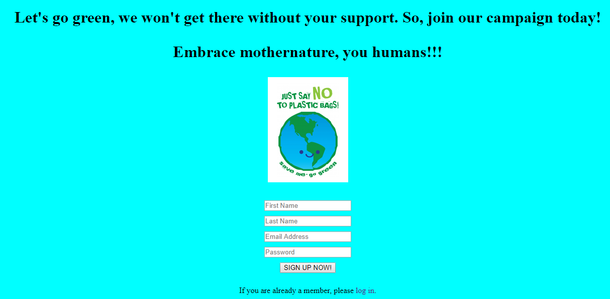

# Petition
The idea behind this project is to create an online petition that visitors can sign to make their voice heard on an issue. In this case, it is a plastic issue. I know you care about our mothernature. Please visit my website and sign my petition: https://eechee.herokuapp.com



## Features
1) Registration and Log-in
* A 'registered' table is created in the database. The table has columns for id (the primary key), first name, last name, email address,   and the hashed password.
* First name, last name, email address, and password are required fields. Email addresses are unique. Error message 'Invalid inputs detected, please insert again!' will pop out when users do not meet the requirements.
* After users register or log in, the id number of the user is stored in cookie-session. 


2) Authentication
* Bcryptjs module is used to hash password when user registers and check the password when user logs in.

3) Cookie-session
* Cookies are set to remember the user ID and signature ID in this project. So that, all the relavant data is retrieved when the user revisits the website again.
* Additionally, cookie-session middleware is used to prevent cookie-tampering issue.
* In this project, cookies expire in two weeks.  

4) Profile data
* Immediately after registration, users are directed to a new page that asks them to provide more information about themselves.
* When the user submits this form, this data is saved in a table named 'profiles'. This table has the columns for id (primary key), user id (foreign key), age, city, and url. All of the fields in this form are optional.


4) Signature page
* A Canvas element is used, so that, users can draw their signature on it. The image data is then converted to a long data url.
* When users submit the form, a POST request is made to server and the submitted data is inserted into a database table named 'signature'. This table has columns for id (the primary key), first name, last name, user ID and signature (the converted data url). 
* Besides, signature ID is set in the req.session. A cookie is set to remember this fact. 
  


5) Thankyou page
* User are redirected to the subsequent page that expresses gratitude for their support. Users can see their signature immediately after signing.
* This is also the page that after signing, users are redirected to here every time they visit the site. 
* Delete the signature is possible. POST method is used to delete the signature permanently. After unsigning, logged-in users will be redirected to the page on which they can sign the petition.
* Two additional links are available here: link to profile details and link to check out all other signers.


6) Profile editing
* When this form is submitted, two queries are done: one thats affects the 'registered' table and another that affects the 'profiles' table. For the 'registered' table, UPDATE command is used since the user definitely has a row in the table. If the user did not submit a new password, the query does not update the password.
* To prevent users from inserting executable Javascript command in input field 'Homepage' (url link), e.g. javascript:alert("hi):

```
if (    
        req.body.homepage != "" &&
        !req.body.homepage.startsWith("http://") &&
        !req.body.homepage.startsWith("https://") &&
        !req.body.homepage.startsWith("//")
    ) {
        req.body.homepage = "http://" + req.body.homepage;
    }
```

* In the case of the 'profiles' table, 'UPSERT' is used since it is unclear whether an UPDATE or an INSERT needed. A row is inserted if one does not already exist and update it if it does:
```
exports.updateProfile = function(age, city, homepage, userID) {
    let q = `INSERT INTO user_profiles (age, city, homepage, user_id)
            VALUES ($1, $2, $3, $4)
            ON CONFLICT (user_id)
            DO UPDATE SET age = $1, city = $2, homepage = $3;`;
    let params = [age, city, homepage, userID];
    return db.query(q, params);
};
```


7) All signers page
* All the people who have already signed the petition are listed on this page. 'Total' shows the number of all signers at the moment.
* One can also check out the additional profile information of other users here. In the case of the homepage url, the name of the users are linked with the saved url in the href attribute.


* The city names are also linked. When these links are clicked, users should be directed to a new page that shows only the people who have signed the petition that live in that city.


8) Log-out
* 'Log-out' click is available on every webpage at the top right corner as users log-in. Logged out users are automatically redirected to the registration page and req.session is set to null.
  
9) Responsive to mobile/tablet devices
* Guess what? This website is made responsive and compatible to all kind of devices. The only challenge of this task is to make Canvas works on mobile devices(touch event is used). Try it out and make a signature(delete the old one if you already had one) on your phone. It works like a charm too.

**_NOTES_**:
* Coding technologies: HTML, CSS, Javascript, canvas, Jquery, DOM, Node.js, Express(handlebars, middleware, router), Jest, SuperTest, Redis(check out [this branch](https://github.com/Ee-Chee/SpicedAcademy-Tabasco-Petition/tree/Master-Redis)), Postgresql, csurf, bcrypt and cookie-session.

Thank you for reading. 9 out of 10 likes to this project.


